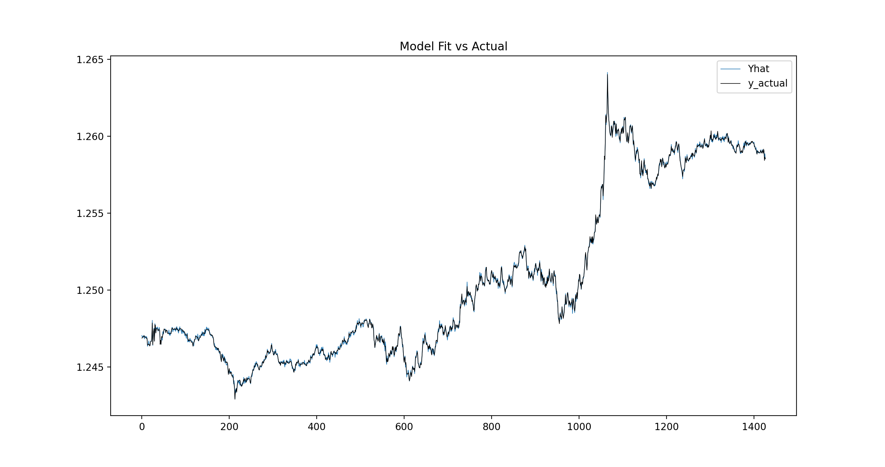

# Bayersian-Optimised-Neural-Network-for-Time-Series-Prediction

Neural network hyperparameter and architecture optimisation using keras tuners for time series prediction.

The deep neural network consists of many layers including, Dense, LSTM, convolutional and max pooling. The bayesian optimiser finds the optimal number of each of these layers plus the optimal number of units in each layer. Albeit a slow process, the optimiser produces much better results than conventionally fitting a neural network. 

# The Code
Code starts with switching the training process to the GPU using plaidml. This is faster and more efficent than training the models on the CPU, especially if you are training 100s.

The inputs are generated into the model using the split_sequence function. This generates a sequence of past observations as input. The number of observations depends on the users stated window size.

Model is built using keras.tensorflow. The hyperparameters to be optimised for the model are the number of convolutional 1d layers, the dropout rate, the number of dense layers within specified constraints.

The bayesian optimsier returned the best model based on validation loss.

## Requirements
* python 3.5.x
* pandas 1.1
* numpy 1.15.0
* matplotlib 3.3.0
* sys
* Tensorflow 2.0
* os
* sklearn
* plaidml

